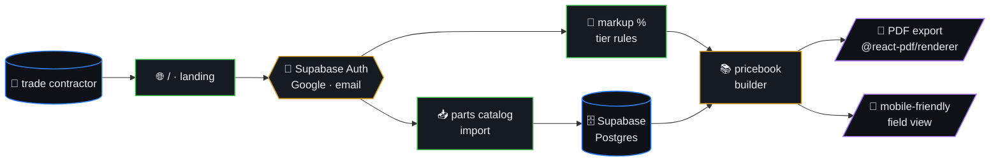

# TradeBooks

> Flat-rate pricebook generator for small trade contractors (HVAC,
> plumbing, electrical). Import your parts catalog, set markup
> percentages, and generate mobile-friendly pricebooks for the field
> on tablets — or print as PDFs.

**Tagline:** "Professional pricebooks in minutes, not months. $29/mo."



## Table of contents

- [Stack](#stack)
- [Architecture](#architecture)
- [Getting Started](#getting-started)

## Stack

- **Framework:** Next.js 14+ (App Router, TypeScript)
- **Database:** Supabase (Postgres + Auth)
- **Auth:** Supabase Google OAuth + email/password
- **Styling:** Tailwind CSS + shadcn/ui
- **PDF Generation:** @react-pdf/renderer or jspdf
- **Deployment:** Vercel
- **Payments:** Stripe (free trial first)

## Architecture

```
src/
├── app/        — App Router pages
├── components/ — UI components
└── lib/        — Supabase, utils
```

## Getting Started

```bash
bun install
bun run dev
```

Open [http://localhost:3000](http://localhost:3000).
